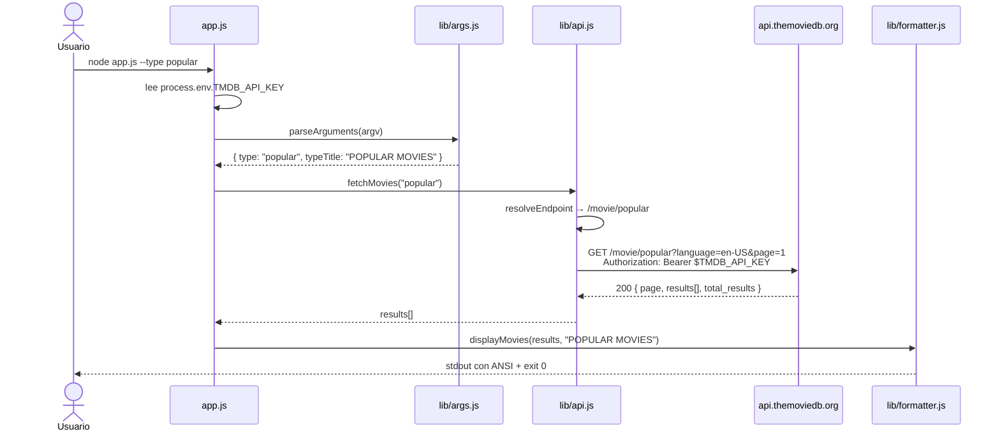
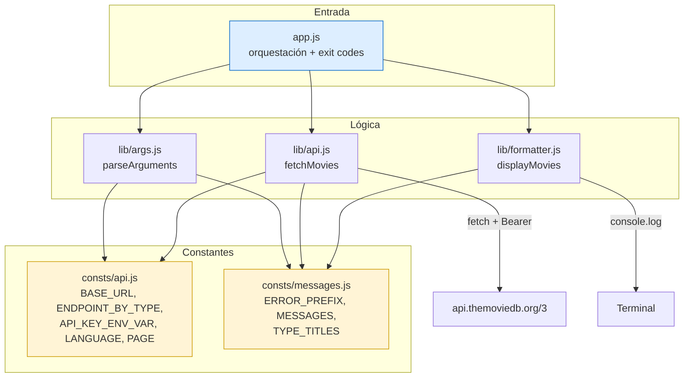

# tmdb-cli

CLI de Node.js sin dependencias para consultar información de películas desde **The Movie Database (TMDB) API** y mostrarla formateada en la terminal.

Desarrollada con **Spec Driven Development**: cada functionality está precedida por su especificación, plan y lista de tareas en `spec/`, y documentada en `docs/` con instrucciones de rollback.

```bash
node app.js --type popular
```

```
POPULAR MOVIES
────────────────────────────────────────────────────────────
1. Dune: Part Two
   Rating: 8.2/10
   Release: 2024-03-01

2. Inside Out 2
   Rating: 7.6/10
   Release: 2024-06-14

3. The Batman
   Rating: 7.7/10
   Release: 2022-03-04

────────────────────────────────────────────────────────────
```

<div align="center">


</div>

## Índice

1. [Descripción](#descripción)
2. [Cómo funciona](#cómo-funciona)
3. [Estructura del proyecto](#estructura-del-proyecto)
4. [Requisitos de instalación](#requisitos-de-instalación)
5. [Instalación](#instalación)
6. [Dominio de datos](#dominio-de-datos)
7. [Referencia de comandos](#referencia-de-comandos)
8. [Manejo de errores](#manejo-de-errores)
9. [Ejemplos de uso](#ejemplos-de-uso)
10. [Tests](#tests)
11. [Limitaciones conocidas](#limitaciones-conocidas)
12. [Documentación técnica](#documentación-técnica)
13. [Licencia](#licencia)

---

## Descripción

| | |
|---|---|
| **Tipo** | CLI (aplicación de línea de comandos) |
| **Runtime** | Node.js `>= 18` (usa `fetch` nativo, sin polyfills) |
| **Lenguaje** | JavaScript (CommonJS) |
| **Dependencias** | 0 — no requiere `npm install` |
| **Autenticación** | Bearer token de TMDB v3 vía variable de entorno |
| **Salida** | Texto con códigos ANSI a `stdout`; errores a `stderr` |

La CLI consulta uno de cuatro listados de películas de TMDB (`now_playing`, `popular`, `top_rated`, `upcoming`), cada uno de los cuales corresponde a una *feature* independiente del ciclo Spec Driven Development, e imprime título, puntuación y fecha de estreno de cada película.

El proyecto aplica una constitución técnica estricta definida en `spec/constitution/`: `app.js` es el único módulo con `try/catch` global, los módulos de `lib/` propagan errores con contexto en lugar de tragárselos, y `consts/` centraliza URLs, endpoints y textos.

## Cómo funciona

El flujo es lineal: variable de entorno → argumentos → petición HTTP → formateo en terminal.

```mermaid
flowchart TD
    A["node app.js --type popular"] --> B{"TMDB_API_KEY<br/>definida?"}
    B -- "no" --> E1["stderr: [ERROR] missingApiKey<br/>exit 1"]
    B -- "sí" --> C["lib/args.js<br/>parseArguments"]
    C --> D{"--type presente<br/>y válido?"}
    D -- "no" --> E2["stderr: [ERROR] missingType<br/>o invalidType<br/>exit 1"]
    D -- "sí" --> F["lib/api.js<br/>fetchMovies"]
    F --> G{"GET api.themoviedb.org/3<br/>/movie/&#123;endpoint&#125;"}
    G -- "fallo de red" --> E3["stderr: [ERROR] networkError<br/>exit 1"]
    G -- "HTTP !ok" --> E4["stderr: [ERROR] httpError<br/>+ status_message<br/>exit 1"]
    G -- "200" --> H{"payload.results<br/>es un array?"}
    H -- "no" --> E5["stderr: [ERROR] invalidResponse<br/>exit 1"]
    H -- "sí" --> I["lib/formatter.js<br/>displayMovies"]
    I --> J["stdout: encabezado + lista<br/>con ANSI · exit 0"]

    style E1 fill:#ffdddd,stroke:#c00
    style E2 fill:#ffdddd,stroke:#c00
    style E3 fill:#ffdddd,stroke:#c00
    style E4 fill:#ffdddd,stroke:#c00
    style E5 fill:#ffdddd,stroke:#c00
    style J fill:#ddffdd,stroke:#0a0
```



### Secuencia de una ejecución correcta



### Formato de salida

`lib/formatter.js` imprime siempre esta estructura, independientemente del tipo consultado:

| Elemento | Contenido |
|---|---|
| Encabezado | `TYPE_TITLES[type]` en **negrita + cian** (`\x1b[1m\x1b[36m`) |
| Separador | 60 caracteres `─` (U+2500) |
| Por cada película | `N.` + título en **negrita**, `Rating:` en **amarillo**, `Release:` en **verde**, y una línea en blanco |
| Cierre | Otros 60 caracteres `─` |

Campos con valores ausentes o de tipo inesperado se sustituyen por textos literales:

| Campo | Valor de TMDB | Si falta o no es válido |
|---|---|---|
| Título | `title` | `Untitled` |
| Puntuación | `vote_average` (número) | `N/A` (formateado a 1 decimal: `8.2/10`) |
| Fecha | `release_date` (string `YYYY-MM-DD`) | `Unknown date` |

Si `results` llega vacío, se imprime `No movies found.` en atenuado (`\x1b[2m`) y se sale con código `0`.

## Estructura del proyecto

```text
tmdb-cli/
├── app.js                          # Punto de entrada (top-level, sin async/await)
├── package.json                    # metadatos, bin y scripts npm
├── consts/
│   ├── api.js                      # URL base, env var, idioma/página y mapa de endpoints
│   └── messages.js                 # textos de error y títulos por tipo
├── lib/
│   ├── args.js                     # parsing y validación de --type
│   ├── api.js                      # petición HTTP autenticada a TMDB
│   └── formatter.js                # formateo e impresión en terminal
├── spec/
│   ├── constitution/               # mission.md, tech-stack.md, roadmap.md
│   └── features/
│       ├── 001-now-playing-movies/ # spec.md, plan.md, tasks.md
│       ├── 002-popular-movies/
│       ├── 003-top-rated-movies/
│       └── 004-upcoming-movies/
└── docs/                           # implementación y rollback por feature
```

### Mapa de módulos



### Responsabilidad de cada módulo

| Archivo | Exporta | Responsabilidad |
|---|---|---|
| `app.js` | — | Guards de API key, try/catch de argumentos, orquesta `fetchMovies().then(displayMovies).catch(exit 1)` |
| `consts/api.js` | `BASE_URL`, `API_KEY_ENV_VAR`, `DEFAULT_LANGUAGE`, `DEFAULT_PAGE`, `ENDPOINT_BY_TYPE` | Constantes de dominio TMDB en `UPPER_SNAKE_CASE` |
| `consts/messages.js` | `ERROR_PREFIX`, `MESSAGES`, `TYPE_TITLES` | Todos los textos visibles y plantillas de error |
| `lib/args.js` | `parseArguments(argv)` | Valida presencia y valor de `--type`; **lanza** en error |
| `lib/api.js` | `fetchMovies(type)` | Resuelve endpoint, autentica, valida `response.ok` y `results[]`; **re-lanza** con contexto |
| `lib/formatter.js` | `displayMovies(movies, typeTitle)` | Imprime el bloque con códigos ANSI |

## Requisitos de instalación

| Requisito | Versión | Verificado en |
|---|---|---|
| Node.js | `>= 18` (por `fetch` nativo en `globalThis`) | v24.15.0 |
| Sistema operativo | Linux, macOS o Windows | Linux |
| Gestor de paquetes | Ninguno — **cero dependencias** | — |
| Cuenta de TMDB | Obligatoria para obtener una API key | — |
| Red | Salida HTTPS a `api.themoviedb.org:443` | — |

## Instalación

### 1. Obtener una API key de TMDB

1. Crea una cuenta en <https://www.themoviedb.org/signup>.
2. Entra en <https://www.themoviedb.org/settings/api>.
3. En la sección **API**, solicita una clave de tipo **Developer** (personal, gratis).
4. Copia tu **API Key (v3 auth)** — es el token que se usará como bearer.

> La API v3 se autentica con un **bearer token** mediante la cabecera `Authorization: Bearer <TMDB_API_KEY>` (decisión documentada en `spec/constitution/tech-stack.md`).

### 2. Configurar la variable de entorno

**Linux / macOS (bash/zsh):**

```bash
export TMDB_API_KEY="tu_api_key_aqui"
```

**Windows (PowerShell):**

```powershell
$env:TMDB_API_KEY="tu_api_key_aqui"
```

**Windows (cmd):**

```cmd
set TMDB_API_KEY=tu_api_key_aqui
```

Verificación rápida de que la variable está definida:

```bash
node -e "console.log(process.env.TMDB_API_KEY ? 'key presente' : 'key AUSENTE')"
```

### 3. Ejecutar

No hay nada que instalar. Clona el repositorio y ejecuta el punto de entrada con Node:

```bash
node app.js --type "playing"
node app.js --type "popular"
node app.js --type "top"
node app.js --type "upcoming"
```

Alternativamente, mediante los scripts de `package.json`:

```bash
npm start          # equivalente a: node app.js --type popular
npm run popular
npm run now-playing
npm run top-rated
npm run upcoming
```

### Instalación global (binario `tmdb-app`) — actualmente no funcional

`package.json` declara el binario `tmdb-app`, y `npm link` lo registra correctamente en el `PATH`, **pero el comando falla** porque `app.js` no tiene el shebang `#!/usr/bin/env node`. Ver [Limitaciones conocidas](#limitaciones-conocidas). Mientras no se corrija, usa `node app.js`.

```bash
# Registra el enlace, pero tmdb-app --type popular aborta con error de sintaxis de bash
npm link
```

## Dominio de datos

### Entradas

| Entrada | Tipo | Formato | Obligatoria | Validación |
|---|---|---|---|---|
| `TMDB_API_KEY` | Variable de entorno | Token alfanumérico de TMDB | **Sí** | Se comprueba por truthiness: ausente **o string vacío** ⇒ error `missingApiKey` (`app.js:8`, `lib/api.js:26`) |
| `argv[2..]` | Array de strings | `--type <valor>` | **Sí** | `lib/args.js:6` busca el flag con `indexOf`, toma el elemento siguiente |
| `--type <valor>` | String enumerado | `playing` \| `popular` \| `top` \| `upcoming` | **Sí** | Se normaliza con `toLowerCase()` (acepta `POPULAR`) y se contrasta contra las claves de `ENDPOINT_BY_TYPE` |

### Salidas

| Flujo | Formato | Contenido |
|---|---|---|
| `stdout` | Texto con ANSI | Encabezado + separadores de 60 chars + una línea por película + separador. Termina siempre en `0x0a` |
| `stderr` | Texto plano | Mensajes `[ERROR] ...` (sin colores) |
| Código de salida | `0` | Ejecución correcta, **incluido** el caso "no hay películas" |
| Código de salida | `1` | Cualquier error: falta de key, argumentos inválidos, fallo de red, error HTTP, respuesta inesperada |

### Petición HTTP emitida

```http
GET /movie/{endpoint}?language=en-US&page=1 HTTP/1.1
Host: api.themoviedb.org
accept: application/json
Authorization: Bearer <TMDB_API_KEY>
```

`language` y `page` se rellenan desde `DEFAULT_LANGUAGE` y `DEFAULT_PAGE` y **no son configurables** por flags (ver [Limitaciones conocidas](#limitaciones-conocidas)).

### Datos devueltos por TMDB y usados

```json
{
  "page": 1,
  "results": [
    {
      "title": "Dune: Part Two",
      "vote_average": 8.2,
      "release_date": "2024-03-01"
    }
  ],
  "total_pages": 1,
  "total_results": 20
}
```

Solo se consumen `results[].title`, `results[].vote_average` y `results[].release_date`. Si la respuesta no contiene un array en `results`, se aborta con `invalidResponse`.

### Persistencia

**Ninguna.** La CLI no escribe archivos, no mantiene caché, no usa base de datos y no envía datos a ningún servicio más allá de la petición GET a TMDB. Es completamente stateless: cada invocación performs una única llamada de red.

## Referencia de comandos

### Parámetros

| Parámetro | Tipo | Obligatorio | Default | Valores válidos | Notas |
|---|---|---|---|---|---|
| `--type <valor>` | String enumerado | **Sí** | — | `playing`, `popular`, `top`, `upcoming` | Case-insensitive. Separador de espacio obligatorio |
| `TMDB_API_KEY` | Variable de entorno | **Sí** | — | Cualquier token válido de TMDB | Se valida antes de parsear argumentos |
| `--help`, `-h` | — | No | — | — | **No implementado**: cae en el error de `--type` |
| `--version`, `-v` | — | No | — | — | **No implementado**: cae en el error de `--type` |

### Tipos de consulta disponibles

| Valor de `--type` | Significado | Endpoint TMDB | Feature |
|---|---|---|---|
| `playing` | Películas en cartelera | `/movie/now_playing` | 001 |
| `popular` | Películas populares | `/movie/popular` | 002 |
| `top` | Películas mejor valoradas | `/movie/top_rated` | 003 |
| `upcoming` | Próximos estrenos | `/movie/upcoming` | 004 |

### Matriz de pruebas

Todas las filas se ejecutaron realmente. `✔` = comportamiento correcto; `✘` = discrepancia detectada. La columna "Real" recoge la salida observada.

#### Argumentos y validación

| Comando | Parámetros | Resultado esperado | Resultado real | Estado |
|---|---|---|---|---|
| `node app.js` | — | error: falta `TMDB_API_KEY` | `[ERROR] TMDB_API_KEY environment variable is not set...` · exit 1 | ✔ |
| `node app.js` | `TMDB_API_KEY=x` | error: falta `--type` | `[ERROR] Missing required flag: --type <value>...` · exit 1 | ✔ |
| `app.js --type popular` | `--type popular` | listado de populares | `POPULAR MOVIES` + 3 películas · exit 0 | ✔ |
| `app.js --type playing` | `--type playing` | cartelera | `NOW PLAYING MOVIES` · exit 0 | ✔ |
| `app.js --type top` | `--type top` | mejor valoradas | `TOP RATED MOVIES` · exit 0 | ✔ |
| `app.js --type upcoming` | `--type upcoming` | próximos estrenos | `UPCOMING MOVIES` · exit 0 | ✔ |
| `app.js --type POPULAR` | mayúsculas | case-insensitive | equivalente a `popular` · exit 0 | ✔ |
| `app.js --type` | flag sin valor | error: falta valor | `Missing required flag: --type <value>` · exit 1 | ✔ |
| `app.js --type --page 2` | valor = flag | error: no consumir flags | `Missing required flag: --type <value>` · exit 1 | ✔ |
| `app.js --type ""` | string vacío | error: falta valor | `Missing required flag: --type <value>` · exit 1 | ✔ |
| `app.js --type foo` | valor inválido | error + lista de válidos | `Invalid --type value. Valid values are: playing, popular, top, upcoming...` · exit 1 | ✔ |
| `app.js --type " pop ular"` | espacios | error: inválido | `Invalid --type value...` · exit 1 | ✔ |
| `app.js --type "popular; rm -rf /"` | inyección shell | error: inválido, sin ejecución | `Invalid --type value...` · exit 1 | ✔ |
| `app.js --type '$(whoami)'` | subshell | error: inválido, sin ejecución | `Invalid --type value...` · exit 1 | ✔ |
| `app.js --help` | ayuda | mostrar usage | `Missing required flag: --type <value>` · exit 1 | ✘ |
| `app.js -h` | ayuda corta | mostrar usage | `Missing required flag: --type <value>` · exit 1 | ✘ |
| `app.js --version` | versión | mostrar `1.0.0` | `Missing required flag: --type <value>` · exit 1 | ✘ |
| `app.js --type=popular` | sintaxis `=` | equivalente a `--type popular` | `Missing required flag: --type <value>` · exit 1 | ✘ |
| `app.js --Type popular` | flag con otra caja | equivalente a `--type popular` | `Missing required flag: --type <value>` · exit 1 | ✘ |
| `app.js movies --type popular` | posicional extra | ignorado | lista populares · exit 0 | ✔ |
| `app.js --type popular --type top` | flag duplicado | primer valor gana | `POPULAR MOVIES` · exit 0 | ✔ |
| `app.js --language es --type popular` | flag desconocido | error o ignorado explícito | ignorado en silencio · exit 0 | ✔* |
| `app.js --type popular --help` | flag tras el válido | listar populares | `POPULAR MOVIES` · exit 0 | ✔* |
| `app.js --type popular </dev/null` | stdin cerrado | funcionamiento normal | listado normal · exit 0 | ✔ |

\* Sin `--type` presente el fallo es correcto; cuando `--type` sí es válido, los flags desconocidos no producen ningún error visible.

#### Configuración y entorno

| Escenario | Resultado esperado | Resultado real | Estado |
|---|---|---|---|
| `TMDB_API_KEY` con valor válido | listado correcto | depende de red; petición correcta a `/movie/{endpoint}?language=en-US&page=1` | ✔ |
| `TMDB_API_KEY=""` (vacío) | error: key no configurada | `[ERROR] TMDB_API_KEY ... is not set` · exit 1 | ✔ |
| `TMDB_API_KEY` con key inválida | error HTTP 401 con detalle | `[ERROR] TMDB API responded with HTTP 401 (Unauthorized). Detail: Invalid API key: You must be granted a valid key. URL: ...` · exit 1 | ✔ |
| Node < 18 | fallar rápido | no verificable en este entorno; `engines` declara `>= 18` | ⚠ |

#### Respuestas HTTP y de red (simuladas con `fetch` interceptado)

| Respuesta simulada | Resultado esperado | Resultado real | Estado |
|---|---|---|---|
| `200` con `results[]` de 3 películas | listado con 3 entradas | 15 líneas, 10 secuencias ANSI · exit 0 | ✔ |
| `200` con `results: []` | mensaje "sin películas", sin error | `No movies found.` · exit 0 | ✔ |
| `200` con objetos sin `title`/`vote_average`/`release_date` | fallbacks | `Untitled`, `N/A/10`, `Unknown date` · exit 0 | ✔ |
| `200` con título con `<script>` y comillas | salida literal segura | impreso literal (inofensivo en terminal) · exit 0 | ✔ |
| `200` con unicode / emoji | salida legible | `🎬 Unicode ñ á é í` correcto · exit 0 | ✔ |
| `200` con body no-JSON | error `invalidResponse` | `[ERROR] TMDB API returned an unexpected or empty response.` · exit 1 | ✔ |
| `200` con body `null` | error `invalidResponse` | `[ERROR] TMDB API returned an unexpected or empty response.` · exit 1 | ✔ |
| `200` sin array `results` | error `invalidResponse` | `[ERROR] TMDB API returned an unexpected or empty response.` · exit 1 | ✔ |
| `401` con `status_message` | error con detalle | `HTTP 401 (Unauthorized). Detail: Invalid API key...` · exit 1 | ✔ |
| `404` con body HTML | error sin detalle | `HTTP 404 (Not Found). URL: ...` · exit 1 | ✔ |
| `500` con body vacío | error sin detalle | `HTTP 500 (Internal Server Error). URL: ...` · exit 1 | ✔ |
| `fetch` lanza `TypeError` | error de red | `[ERROR] Network error while reaching TMDB API: fetch failed` · exit 1 | ✔ |

#### Scripts de `package.json`

| Comando | Script | Resultado real | Estado |
|---|---|---|---|
| `npm start` | `node app.js --type popular` | `POPULAR MOVIES` · exit 0 | ✔ |
| `npm run now-playing` | `node app.js --type playing` | `NOW PLAYING MOVIES` · exit 0 | ✔ |
| `npm run popular` | `node app.js --type popular` | `POPULAR MOVIES` · exit 0 | ✔ |
| `npm run top-rated` | `node app.js --type top` | `TOP RATED MOVIES` · exit 0 | ✔ |
| `npm run upcoming` | `node app.js --type upcoming` | `UPCOMING MOVIES` · exit 0 | ✔ |
| `npm run <inexistente>` | error de npm | exit 1 | ✔ |
| `npm link` + `tmdb-app` | listado correcto | error de sintaxis de bash · exit 2 | ✘ |

## Manejo de errores

Todos los fallos terminan con `process.exit(1)` y un mensaje en `stderr` precedido por `[ERROR]`. Los mensajes están centralizados en `consts/messages.js`.

| Caso | Mensaje | Exit |
|---|---|---|
| Falta `TMDB_API_KEY` (o está vacía) | `TMDB_API_KEY environment variable is not set. Set it before running the app. Example: TMDB_API_KEY=your_key node app.js --type "playing".` | 1 |
| Falta `--type`, o sin valor, o seguido de otro flag | `Missing required flag: --type <value>. Example: --type "playing".` | 1 |
| `--type` inválido | `Invalid --type value. Valid values are: playing, popular, top, upcoming. Example: --type "playing".` | 1 |
| Fallo de red / DNS / TLS | `Network error while reaching TMDB API: <motivo>` | 1 |
| Respuesta HTTP no 2xx | `TMDB API responded with HTTP <status> (<statusText>). Detail: <status_message de TMDB>. URL: <url completa>` | 1 |
| JSON inválido, `null` o sin array `results` | `TMDB API returned an unexpected or empty response.` | 1 |
| Binario sin shebang (solo `tmdb-app`) | error de sintaxis de bash, sin prefijo `[ERROR]` | 2 |

Ejemplo de captura de `stderr` manteniendo el código de salida:

```bash
output=$(node app.js --type popular 2>&1) || echo "falló con exit $?"
```

## Ejemplos de uso

Salida real capturada en las pruebas (con `--type playing`):

```
NOW PLAYING MOVIES
────────────────────────────────────────────────────────────
1. Dune: Part Two
   Rating: 8.2/10
   Release: 2024-03-01

2. Inside Out 2
   Rating: 7.6/10
   Release: 2024-06-14

3. The Batman
   Rating: 7.7/10
   Release: 2022-03-04

────────────────────────────────────────────────────────────
```

### Cartelera

```bash
export TMDB_API_KEY="tu_api_key_aqui"
node app.js --type playing
```

### Sólo las 10 primeras líneas (encabezado + 2 películas)

```bash
node app.js --type popular | head -10
```

### Guardar el resultado en un archivo

```bash
node app.js --type top > top-rated.txt
```

### Quitar los códigos de color

```bash
node app.js --type upcoming | sed 's/\x1b\[[0-9;]*m//g'
```

### Usar un valor concreto sólo para una invocación

```bash
TMDB_API_KEY="tu_api_key_aqui" node app.js --type upcoming
```

### Comprobar la conectividad antes de lanzar

```bash
node app.js --type popular >/dev/null 2>&1 && echo "API accesible" || echo "revisa TMDB_API_KEY y la red"
```

## Tests

**No existe suite de tests automatizados.** `package.json` no define script `test` ni `lint`, y no hay dependencias de desarrollo. Las 33 pruebas de este README se ejecutaron de forma manual con este procedimiento:

```bash
cd tmdb-cli

# 1. Casos de error sin necesidad de red ni key
node app.js                                    # exit 1, falta API key
TMDB_API_KEY=x node app.js                     # exit 1, falta --type
TMDB_API_KEY=x node app.js --type foo          # exit 1, tipo inválido

# 2. Casos de red (requiere key real)
TMDB_API_KEY=<real> node app.js --type popular # exit 0 + listado
TMDB_API_KEY=falsa node app.js --type popular # exit 1, HTTP 401 con detalle

# 3. Scripts npm
npm start && npm run now-playing && npm run top-rated && npm run upcoming

# 4. Binario global (documenta el bug del shebang)
npm link && tmdb-app --type popular
```

Para aislar la capa de red y probar el happy path sin una key válida, se puede interceptar `fetch` con un preload de Node:

```bash
TMDB_API_KEY=dummy node -r ./mock-fetch.js app.js --type popular
```

Los criterios de aceptación definidos en `spec/features/NNN-*/spec.md` cubren este mismo conjunto de escenarios como texto; no están automatizados.

## Limitaciones conocidas

Detectadas durante la verificación de esta CLI:

| # | Severidad | Problema | Detalle | Corrección propuesta |
|---|---|---|---|---|
| 1 | **Crítica** | El binario `tmdb-app` no arranca | `package.json:6-8` declara `bin`, pero `app.js` **no tiene shebang**. `npm link` sólo cambia el modo a `755`; el kernel ejecuta el archivo con bash y aborta con `error sintáctico cerca del elemento inesperado '('` y exit `2`. Las cuatro invocaciones `tmdb-app --type ...` documentadas no funcionan | Añadir `#!/usr/bin/env node` como primera línea de `app.js` (verificado: con esa línea el flujo da exit `0` con salida formateada) |
| 2 | Media | No hay `--help` ni `--version` | `tmdb-app --help`, `-h`, `--version` y `-v` devuelven el error de `--type` en vez de un usage. No hay forma de descubrir los valores válidos sin leer el código | Tratar `--help`/`-h` en `lib/args.js` y devolver el uso con exit `0` |
| 3 | Baja | Los flags desconocidos se ignoran en silencio | `--language es`, `--type popular --help` y los posicionales extra no producen ningún aviso, lo que puede dar la falsa impresión de que el filtro se aplicó | Rechazar flags no reconocidos con un mensaje explícito |
| 4 | Baja | `--type=valor` no se parsea | La sintaxis con `=` es habitual y aquí produce `Missing required flag` | Soportar `--type=valor` además del par separado |
| 5 | Baja | `N/A/10` como placeholder | Cuando falta `vote_average` se imprime `N/A/10`, una puntuación imposible de leer | Imprimir `N/A` sin el sufijo, o `Rating: N/A` en línea propia |
| 6 | Info | `language` y `page` fijos | `consts/api.js:5-7` los fija a `en-US` y `1`; siempre se devuelve la primera página (20 películas) | Añadir flags `--language` y `--page` si se requiere |
| 7 | Info | Sin `--help` en la documentación previa | El `README.md` anterior no mencionaba los cuatro comandos del `package.json` (`npm run *`) | Corregido en este README |

## Documentación técnica

- **Constitución del proyecto** (misión, stack técnico, roadmap): `spec/constitution/`
- **Especificaciones por feature**: `spec/features/NNN-*/spec.md`, con `plan.md` y `tasks.md`
- **Detalle de implementación y rollback**: `docs/feature-001-now-playing.md` … `docs/feature-004-upcoming.md`
- **Referencia del API externo**: [TMDB API Reference](https://developer.themoviedb.org/reference)

### Historial de features

| Feature | Commit | Alcance |
|---|---|---|
| 001 | `feat(001)` | Flujo de cartelera (`--type playing`) |
| 002 | `feat(002)` | Flujo de populares (`--type popular`) |
| 003 | `feat(003)` | Flujo de mejor valoradas (`--type top`) |
| 004 | `feat(004)` | Flujo de próximos estrenos (`--type upcoming`) |

### Rollback de una feature

```bash
# Localizar el commit de la feature
git log --oneline -- tmdb-cli/spec/features/001-now-playing-movies

# Revertir creando un commit inverso
git revert <hash>

# O restaurar solo los archivos de código de esa feature
git checkout <hash>~1 -- tmdb-cli/app.js tmdb-cli/consts tmdb-cli/lib
```

> Las features 002/003/004 amplían `consts/api.js` y `lib/args.js` sobre la base de 001: si reviertes 001, vuelve a verificar la coherencia de `ENDPOINT_BY_TYPE` y `TYPE_TITLES` con las features restantes.

## Licencia

MIT — ver [package.json](package.json).